## 名词 

以下都是预检查，类似于`(?:)`非捕获型分组，匹配到的内容不会被捕获

- `(?=pattern)` _Positive Lookahead Assert_ 正向肯定预检查

- `(?<=pattern)` _Positive Lookbehind Assert_ 反向肯定预检查

- `(?!pattern)` _Negative Lookahead Assert_ 正向否定预检查

- `(?<!pattern)` _Negative Lookbehind Assert_ 反向否定预检查

## 相关 API

首先需要看一下 [`RegExp.prototype.exec()`](https://developer.mozilla.org/en-US/docs/Web/JavaScript/Reference/Global_Objects/RegExp/exec#description)
这个正则对象上的方法。

如果你和我一样对 exec 执行结果中的 groups 对象为啥总是 `undefined` 感到疑问, 具体查看 MDN 上
[RegExp.prototype.exec()](https://developer.mozilla.org/en-US/docs/Web/JavaScript/Reference/Global_Objects/RegExp/exec#groups)
返回结果中 `groups` 字段的解释:

> A null-prototype object of named capturing groups, whose keys are the names, and values are the
> capturing groups, or undefined if no named capturing groups were defined. See capturing groups for more information.

可以看到这个这里面只包含了 `named` capturing groups，也就是命名捕获型分组，而不是普通的捕获型分组。

冷知识：命名捕获型分组是 ES2018 引入的，所以在 ES2018 之前的版本中，`groups` 字段是 `undefined` 的。

以这个正则表达式为例 `/(?<title>\w+), yes \k<title>/` [点击跳转 regex101 ](https://regex101.com/r/GJH4n2/1)，
可以看到 `title` 就是一个 _named caputuring group_。 而 `\k<title>` 则是一个 _backreference_。

## 举例说明

### 1. 普通的捕获型正则

```js
/windows(95|NT|xp)/.exec("windows95OtherString");
```

**console：**

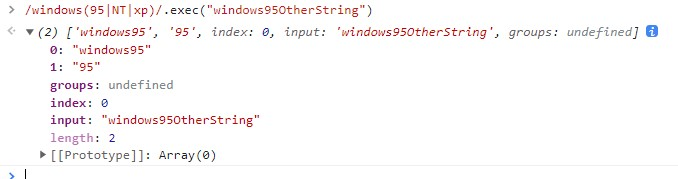

**regex101：**

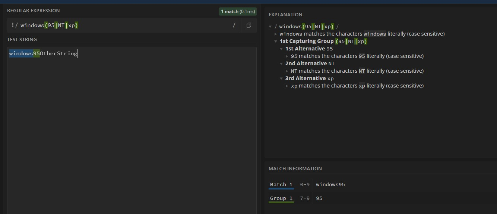

### 2. 正向肯定预检查 Postive Lookahead

```js
/windows(?=95|NT|xp)/.exec("windows95hahahah");
```

**console：**

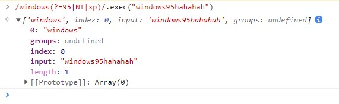

**regex101：**

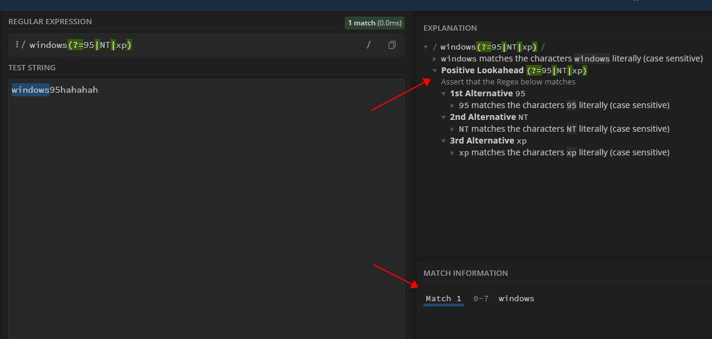

### 3. 反向肯定预检查 Positive Lookbehind

```js
/(?<=95|NT|xp)windows/.exec("NTwindows");
```

**console：**

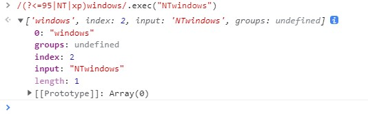

**regex101：**

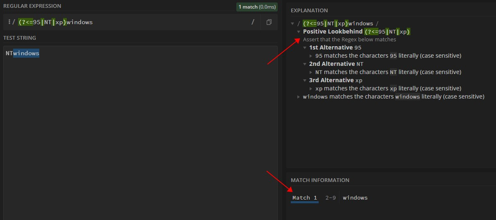

### 4. 正向否定预检查 Negative Lookahead

```js
/windows(?!95|NT|xp)/.exec("windows10heihei");
```

**console：**

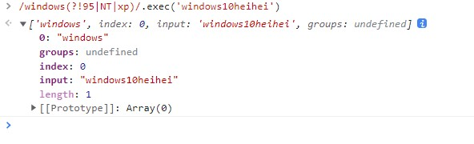

**regex101：**

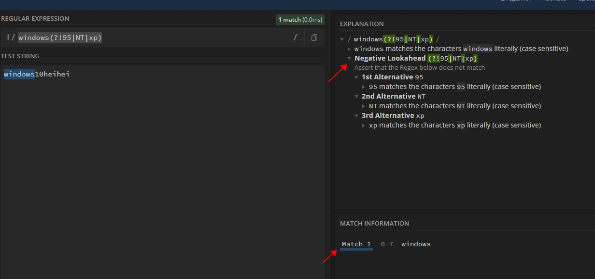

### 5. 反向否定预检查 Negative Lookbehind

```js
/(?<!95|NT|xp)windows/.exec("haha10windows");
```

**console：**

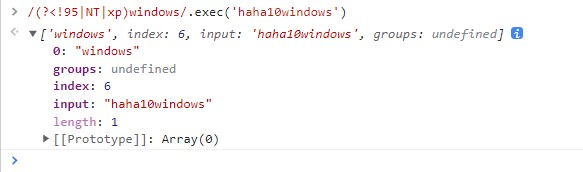

**regex101：**

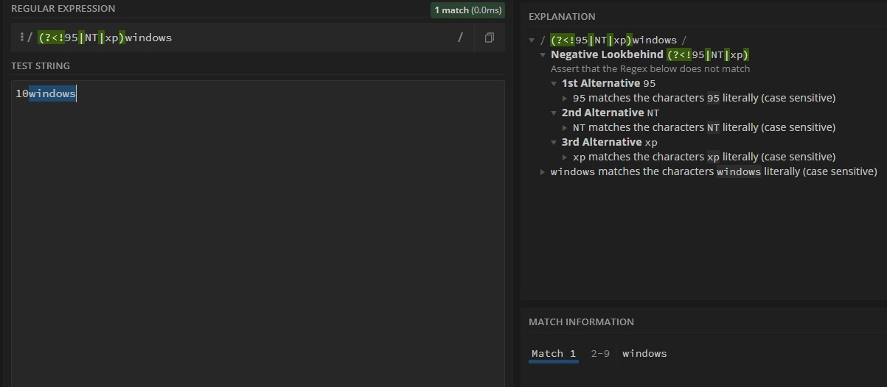

### 总结

其中 `?` 表示非捕获型匹配

以从左到右为正方向，`lookahead` 指的是 _括号里面的正则_ 在 _匹配字符串_ 前方。`lookbehind` 则表示 _括号里面的正则_ 在 _匹配字符串_ 后方，使用`<`来表示在后方。

`Positive` or `Negative` 分表表示 `是` or `否` 匹配括号里的正则。符号分别为 `=` 和 `!`

由于都是 `non-capturing-group`(非捕获型分组)，所以结果匹配到的字符串，都不会包括括号里面的，即上面的例子中的 `windows`。

## 千位分隔符 Look Ahead Positive Assert 

```js
"12345678.32423432".replace(/(\d)(?=(\d{3})+\.)/g, "$1,");
```

**解释：**

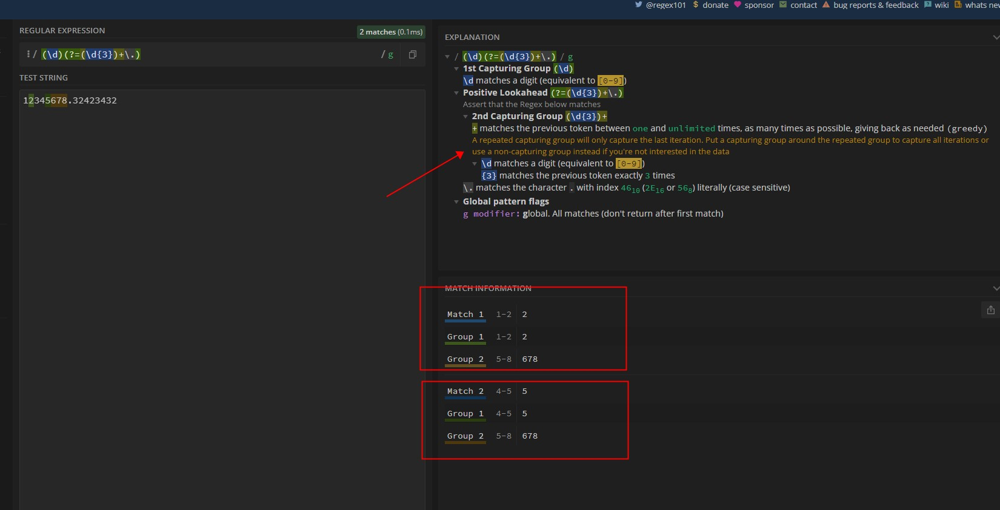

上面的千分位分隔正则表达式对没有小数点部分的字符串无效，更完整的可以使用如下的方法：

```js
export function toThousands(num) {
  return num.toString().replace(/\d+/, (n) => {
    return n.replace(/\B(?=((\d{3})+\b))/g, ",");
  });
}

toThousands(12345.489101);
// 输出为 '12,345.489101'
```

Copilot 做如下解释：

Here's a breakdown of how it works:

1. `num.toString()`: This converts the input number to a string. This is necessary because the `replace` method is a string method and doesn't work directly on numbers.

2. `.replace(/\d+/, (n) => {...})`: This uses a regular expression to match one or more digits in the string. For each match, it calls a function that takes the matched string `n` as an argument and returns a new string.

3. Inside the function, `n.replace(/\B(?=((\d{3})+\b))/g, ",")` is used to add commas in the appropriate places.

   - `\B` matches a position where the previous and next character are either both words or both non-words. This ensures we're not at the beginning of the string.
   - `(?=((\d{3})+\b))` is a positive lookahead that matches a group ahead in the string without including it in the result. It looks for one or more groups of three digits (`\d{3}`) that are not followed by a word boundary (`\b`). This effectively matches every group of three digits that are at the end of a larger group of digits.
   - `/g` is the global flag for the regular expression, which means the replacement will happen for all matches in the string, not just the first one.
   - `","` is the replacement string, which will replace each match of the regular expression (i.e., each place where a comma should go).

So, if you call `add_comma_every_thousand(1234567)`, the function will return the string `"1,234,567"`. This function can be useful in a variety of applications where you need to display large numbers in a more readable format.

## 关于正向/反向更典型的举例

```js
"hello world".replace(/(?=hello)/g, ",");
// 输出为 ',hello world'

"hello world".replace(/(?<=hello)/g, ",");
// 输出为 'hello, world'
```

可以看到，`(?=hello)` 表示匹配 `hello` 前面的位置，而 `(?<=hello)` 表示匹配 `hello` 后面的位置，然后被 `,` 替换。

## Reference

1. <https://segmentfault.com/q/1010000004651380>

2. [PCRE 表达式全集](https://zh.wikipedia.org/wiki/%E6%AD%A3%E5%88%99%E8%A1%A8%E8%BE%BE%E5%BC%8F#PCRE%E8%A1%A8%E8%BE%BE%E5%BC%8F%E5%85%A8%E9%9B%86)

3. [Regex101](https://regex101.com/) 目前为止遇到最强的解释正则工具网站，其他的还有 [RegExr](https://regexr.com/)
